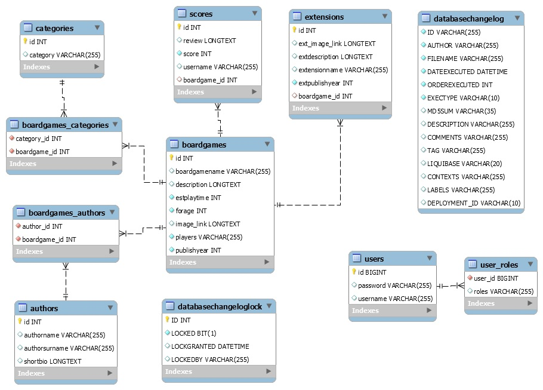

# RankBoard
Back-End with MySql database for RankBoard Application.

## Table of contents
* [Technologies](#technologies)
* [Database schene](#database-scheme)
* [Other information](#other-information)

## Introduction
This project is a Spring Boot application with MySQL database that uses REST API for communication with Front-End.
It contains sample data (added through liquibase) for demonstration.

## Technologies
* Spring Boot
* Spring Data
* Spring Web
* Spring Security
* Liquibase
* Lombok
* Swagger
* MapStruct

## Database scheme

## Other information
This app was inspired by https://boardgamegeek.com/.

